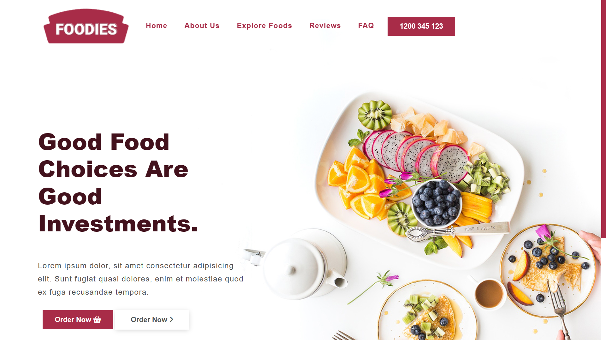

# Foodies: Healthy Food Website

## Overview

Foodies is a website dedicated to promoting healthy eating habits. The homepage provides users with instant order feature. The goal is to encourage people to make healthier food choices.

## Project Screenshots

Here are some screenshots from the project:

 

## Technologies Used

- **HTML**
- **CSS**
- **JavaScript**

## Installation and Setup
To run this project locally, follow these steps:

1. Clone the repository: git clone https://github.com/Bilal00404/foodies.git
2. Navigate to the project directory: cd foodies
3. Open the HTML file in your preferred browser.

## Contact
If you have any questions or suggestions, feel free to contact me at bilalchanna67@gmail.com.
